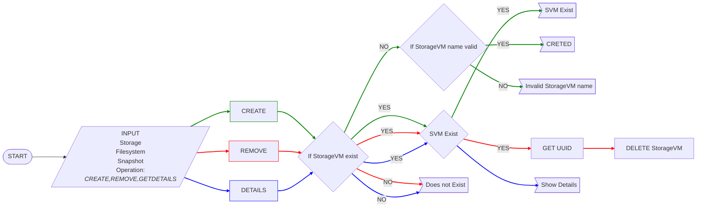

# NetApp_StorageVM
Python program that connects to NetApp server using RestAPI, lets user create, remove and get the details of a Storage VM from NetApp server.


### Features
- `CREATE` a StorageVM into a given storage
- `DELETE` a StorageVM into a given storage
- Get the `LIST` of StorageVMs
- Helpful CLI

### Requirements
- Python 3.6 or higher
- ONTAP 9 (NetApp storage system) or higher (untested on earlier versions)
- Install docopt

Check [install docopt](https://pypi.org/project/docopt/) for more information


### Usage Example
## Run the program


1. Creating a StorageVM

```bash
netapp_SVM.py -s [STORAGE] -VM [SVM]  --create
```

2. Remove a StorageVM
```bash
netapp_SVM.py -s [STORAGE] -VM [SVM]  --remove
```

3. GET a list of all StorageVM
```bash
netapp_SVM.py -s [STORAGE] -VM [SVM] --list
```
    		

4. HELP
```
netapp_SVM.py -h | --help
```

- [STORAGE] => name of your storage
- [SVM] => name of StorageVM

##FLOWCHART

